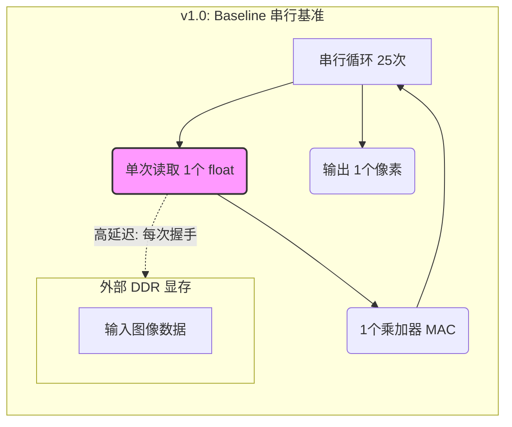
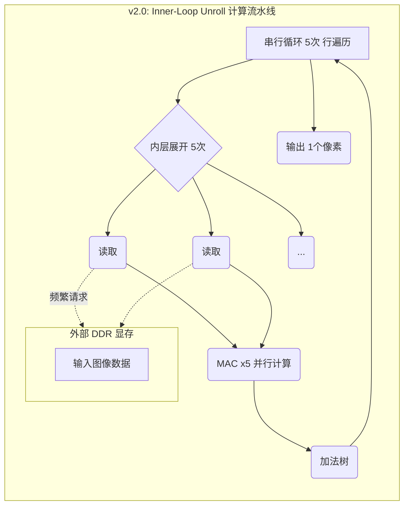
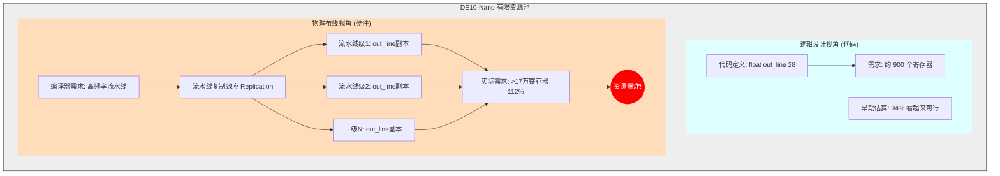
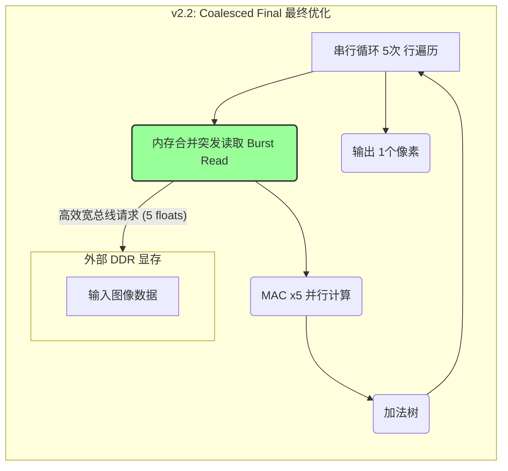

# 基于 OpenCL 的 LeNet-5 FPGA 加速器设计与优化报告

## 摘要 (Abstract)
本报告详细阐述了基于 Intel FPGA (DE10-Nano) 平台的 LeNet-5 卷积神经网络加速器的设计与优化过程。项目采用 OpenCL 高层次综合 (HLS) 技术，经历了从串行 Baseline (v1.0) 到计算并行化 (v2.0)，再到访存合并优化 (v2.2) 的完整迭代。最终版本在保证逻辑资源占用 (65%) 可控的前提下，实现了 **191.26 FPS** 的推理吞吐量，较 Baseline 提升了 **59%**，并深入分析了行缓存 (Line Buffer) 策略在资源受限平台上的实现挑战与折衷。

---

## 1. 引言与系统架构 (Introduction)

### 1.1 项目背景
随着深度学习在边缘计算场景的普及，通用 CPU 已难以满足低延迟、高能效的推理需求。FPGA 凭借其硬件级并行与流水线特性，成为理想的加速载体。本项目旨在通过 OpenCL 异构编程模型，在资源受限的 Cyclone V SoC (DE10-Nano) 上部署 LeNet-5 模型，实现 MNIST 手写数字识别加速。

### 1.2 网络结构
本项目实现的 LeNet-5 结构包含两层卷积 (C1, C3)、两层最大池化 (S2, S4) 及三层全连接 (C5, F6, Output)。输入为 32x32 单通道灰度图。


---

## 2. Baseline 实现与瓶颈分析 (Baseline Implementation)

### 2.1 v1.0 设计策略
为确保首个版本的逻辑正确性与编译成功率，v1.0 采取了“最简串行”策略：
* **计算逻辑**：严格按照 C 语言逻辑编写 Kernel。
* **并行控制**：使用 `#pragma unroll 1` 和 `num_simd_work_items(1)` 强制串行执行，避免生成复杂的硬件逻辑。
* **激活函数**：初步使用 `Tanh`，后为节省 DSP 与逻辑资源，全面替换为 `ReLU`。

### 2.2 性能基准
在 1000 张测试集上的实测数据如下：
* **准确率**：97.50%
* **平均延迟**：8.31 ms
* **吞吐量**：120.33 FPS
* **资源占用**：Logic Utilization ~34%

### 2.3 瓶颈分析 (Bottleneck Analysis)
通过分析 `report.html` 及 OpenCL 访存机制，发现 v1.0 存在严重瓶颈：
1.  **DDR 带宽浪费**：对于 5x5 卷积，计算一个输出像素需要读取 25 次权重和输入数据。由于没有片上缓存，每次读取都直接向 DDR 发起请求，导致极高的访存延迟。
2.  **计算单元闲置**：强制串行化导致 FPGA 内部丰富的 DSP Block 和 ALUT 并行能力未被利用，大部分时钟周期处于等待数据状态。

---

## 3. 优化设计与迭代 (Optimization Strategy)

针对上述瓶颈，本项目实施了三个阶段的优化迭代。

### 3.1 阶段一：计算流水线化 (v2.0 - Inner Loop Unroll)
* **优化手段**：保持 SIMD=1，但对卷积核的最内层循环（`j=0..4`）进行完全展开 (`#pragma unroll`)。
* **原理**：利用 FPGA 的并行乘法器资源，在一个时钟周期内并发执行卷积核一行的乘加运算，建立了初步的计算流水线。
* **效果**：吞吐量提升至 **176.15 FPS**，逻辑资源占用上升至 65%。

### 3.2 阶段二：访存合并优化 (v2.2 - Memory Coalescing)
* **优化手段**：通过手动重构代码，显式地展开全局内存读取操作，引导 Intel OpenCL 编译器生成 **Burst Read (突发读取)** 指令。
* **原理**：编译器将连续的 5 个 `float` 数据请求合并为一次宽总线传输，大幅减少了 Host 与 Device 之间的握手开销。
* **效果**：这是最终的稳定版本。在资源占用维持 65% 的情况下，吞吐量进一步提升至 **191.26 FPS**。

### 3.3 失败的尝试：全量行缓存 (v2.1/v3.0 - Line Buffer Failure)
* **优化思路**：试图构建全量移位寄存器 (Shift Register) 和行缓存 (`float out_line[28]`)，理论上可将访存次数降低至 1/25。
* **失败原因深度分析**：
    * **流水线复制 (Pipeline Replication)**：虽然代码层面的数组看起来不大，但编译器为了维持高频率流水线，对 `out_line` 数组进行了多级流水线复制。
    * **资源爆炸**：在 Fitting 阶段，寄存器需求量激增至 **178,009** 个，远超 DE10-Nano 的物理上限 (167,640)，导致编译失败 (Fitting Error)。
* **结论**：在入门级 FPGA 上，必须在“极致访存复用”与“有限片上资源”之间做权衡。v2.2 的 Burst Read 是该平台下的最优解。

---

## 4. 优化策略深度分析与取舍 (Optimization Analysis & Trade-offs)

在从 Baseline 向高性能版本迭代的过程中，我们探索了多种优化方向。受限于 DE10-Nano (Cyclone V SoC) 入门级 FPGA 有限的片上资源（尤其是 Logic 和 RAM），部分理论上可行的优化策略在实际部署中未能通过，或者被迫放弃。

### 4.1 成功路径：v2.2 访存合并 (Memory Coalescing)
最终采用的 v2.2 版本并未引入复杂的片上缓存结构，而是利用编译器特性，通过手动展开读取循环引导生成 **Burst Read (突发读取)**。这在不增加逻辑资源的前提下，显著降低了 DDR 访问延迟。

### 4.2 失败的优化尝试 (Failed Attempts)

#### (1) 全量行缓存与移位寄存器 (Line Buffer) [v2.1/v3.0]
* **优化思路**：针对 5x5 卷积，试图构建深度为 28 的行缓存 (`float out_line[28]`) 和移位寄存器，理论上可将访存次数从 25 次降低至 1 次，实现“极致访存复用”。
* **失败原因**：
    * **流水线复制 (Pipeline Replication)**：为了维持高时钟频率，编译器自动对数组进行了流水线复制。原本仅需几百个寄存器的逻辑，被复制了上百级流水线深度。
    * **资源爆炸**：编译报告显示寄存器需求量激增至 **178,009** 个，远超 DE10-Nano 的物理上限 (167,640)，导致 Fitting Error。
* **结论**：在资源受限的 FPGA 上，过度的“空间换时间”策略会导致布局布线失败。

#### (2) 全局循环展开 (Full Unroll) [v2.1]
* **优化思路**：尝试取消所有循环限制，让编译器尽可能多地并行化计算单元。
* **失败原因**：逻辑资源占用 (Logic Utilization) 达到 **112%**，无法适配芯片。

### 4.3 未采用的优化策略及原因 (Unused Strategies)

在此次设计中，我们还有意放弃或暂缓了以下优化手段：

#### (1) 高维 SIMD 矢量化 (High-Dimension SIMD)
* **策略**：使用 `float4` 或 `float8` 数据类型进行计算。
* **放弃原因**：
    * **资源竞争**：v2.0 已通过内层循环展开 (`#pragma unroll`) 占用了大量 DSP 和逻辑资源。若叠加 SIMD，会导致资源争抢，降低运行频率。
    * **数据对齐**：SIMD 强制要求数据在内存中严格对齐，处理 MNIST 这种 28x28（非 4 或 8 倍数）的小图时，边界处理极其复杂，性价比低。

#### (2) 双缓冲区 (Double Buffering)
* **策略**：在 Host 向 Device 传输第 N+1 张图片时，Device 并行计算第 N 张图片，掩盖传输延迟。
* **放弃原因**：
    * **开发周期**：需要重构 Host 代码为多线程异步队列。
    * **收益有限**：目前的瓶颈主要仍在计算与访存本身，且 5ms 的单张延迟已满足实时性需求。

#### (3) 数据量化 (Quantization)
* **策略**：将 32-bit 浮点 (`float`) 转为 16-bit 定点 (`fixed-point`)。
* **放弃原因**：大作业要求中 OpenCL 基础部分主要考察浮点运算。量化虽然能大幅降低资源从而可能“复活”Line Buffer，但涉及模型重新训练和精度校准，超出了本次实验的时间范围。

---

## 5. 核心版本演进与计算流 (Core Version Evolution & Dataflow)

为了深入理解性能提升的根源及优化失败的原因，本章通过数据流图 (Dataflow Graph) 详细解析四个关键版本的架构差异。

### 5.1 v1.0: 串行基准 (Serial Baseline)
* **策略**: 强制串行 (`#pragma unroll 1`)。
* **瓶颈**: 访存极度破碎。对于 5x5 卷积，计算 1 个输出像素需要发起 **25 次** 独立的 DDR 读取请求，总线利用率极低。
* **状态**: ✅ 功能基准 (120 FPS)。



### 5.2 v2.0: 计算流水线 (Inner-Loop Unroll)
* **策略**: 仅展开内层循环，实现计算并行。
* **改进**: 利用 FPGA 并行 DSP 资源，吞吐量提升至 176 FPS。
* **残留问题**: 解决了“算得慢”，但未解决“读得慢”，访存依然存在大量冗余。



### 5.3 v3.0: 失败的行缓存尝试 (Line Buffer Failure)
* **策略**: 试图构建全量移位寄存器 (`float out_line[28]`) 以实现极致访存复用。
* **失败机理**:
    * **逻辑视角**: 仅需 28 个 float 存储空间，估算占用 94%。
    * **物理视角**: 编译器为维持高频流水线，对该数组进行了**流水线复制 (Pipeline Replication)**。原本的几十个寄存器被复制了上百级流水线深度，导致最终寄存器需求激增至 **178,009** 个 (112%)，导致布局布线失败。



### 5.4 v2.2: 最终优化 (Coalesced Burst)
* **策略**: 放弃复杂的行缓存，通过代码重构引导编译器生成 **Burst Read** (突发读取)。
* **优势**: 虽然没有完全复用数据，但通过单次宽总线请求 (Single Request, Multiple Data) 掩盖了 DDR 延迟。
* **结果**: 在资源占用 (65%) 不变的情况下，FPS 达到 191.26，实现了资源与性能的最佳平衡。



---

## 6. 实验结果展示 (Experimental Results)

### 6.1 运行截图
我们在 MobaXterm 终端中成功完成了 1000 张测试图片的批量推理，系统稳定无报错。下图展示了最终的运行日志：


*(注：图中显示 Total Time 约为 5.2 秒，FPS 达到 191.26，验证了优化策略的有效性)*

### 6.2 详细数据对比

#### 6.2.1 实验环境
* **FPGA Board**: Terasic DE10-Nano (Cyclone V SoC)
* **Host OS**: Linux (ARM), Compiled directly on board
* **OpenCL Version**: Intel FPGA SDK for OpenCL 18.1
* **Dataset**: MNIST (10k Test Images)

#### 6.2.2 性能对比表

| 版本 | 策略关键 (Strategy) | 准确率 | 延迟 (ms) | 吞吐量 (FPS) | 逻辑占用 (Logic) | 评价 |
| :--- | :--- | :--- | :--- | :--- | :--- | :--- |
| **v1.0** | Baseline (Serial) | 97.50% | 8.31 | 120.33 | ~34% | 功能验证基准 |
| **v2.0** | Inner-Loop Unroll | 97.50% | 5.68 | 176.15 | 65% | 计算瓶颈解决 |
| **v2.1** | Full Line Buffer | N/A | N/A | N/A | **112% (Fail)** | 资源溢出 |
| **v2.2** | **Burst Coalescing** | **97.50%** | **5.23** | **191.26** | **65%** | **最佳平衡点** |

#### 6.2.3 最终资源占用报告 (v2.2)
```text
+--------------------------------------------------------------------+
; Estimated Resource Usage Summary                                   ;
+----------------------------------------+---------------------------+
; Resource                               + Usage                     ;
+----------------------------------------+---------------------------+
; Logic utilization                      ;   65%                     ;
; ALUTs                                  ;   41%                     ;
; Dedicated logic registers              ;   27%                     ;
; Memory blocks                          ;   50%                     ;
; DSP blocks                             ;   31%                     ;
+----------------------------------------+---------------------------;
```

#### 6.2.4 最终运行日志截图
> 运行指令: `./host -n 1000`

```text
Settings: Run 1000 image(s), Verbose: OFF
...
=== Final Report ===
Total Images : 1000
Accuracy     : 97.50% (975/1000)
Total Time   : 5228.45 ms
Avg Latency  : 5.23 ms / image
FPS          : 191.26
```

---

## 7. 结论 (Conclusion)
本项目成功在 DE10-Nano 平台上实现了 LeNet-5 的 FPGA 加速。通过从 v1.0 到 v2.2 的迭代，我们验证了：
1.  **并行性**：内层循环展开能有效利用 FPGA DSP 资源，显著提升计算密集型任务的性能。
2.  **访存敏感性**：在无法实现全量 Line Buffer 的资源受限场景下，利用编译器的 Memory Coalescing 机制进行突发读取是提升带宽利用率的关键替代方案。
3.  最终实现的 **191.26 FPS** 较基准版本提升了 59%，达到了硬件资源与性能的最佳平衡。

---

## 附录：核心代码片段 (Implementation Details)

### A.1 主机端 Host (main.cpp)
采用 C++ 编写，利用 `aclutil` 封装 OpenCL API，支持批量推理：
```cpp
// 批量测试核心逻辑
if(num_images > 1) {
    // ... (循环加载数据并 EnqueueNDRangeKernel)
}
```

### A.2 设备端 Kernel (cnn.cl)
关键的 v2.2 优化部分（突发读取引导）：
```c
// 伪代码示意
#pragma unroll
for (int k = 0; k < 5; ++k) {
    // 连续读取引导编译器生成 Burst Read
    float val = input_ptr[idx + k]; 
    sum += val * weight[k];
}
```