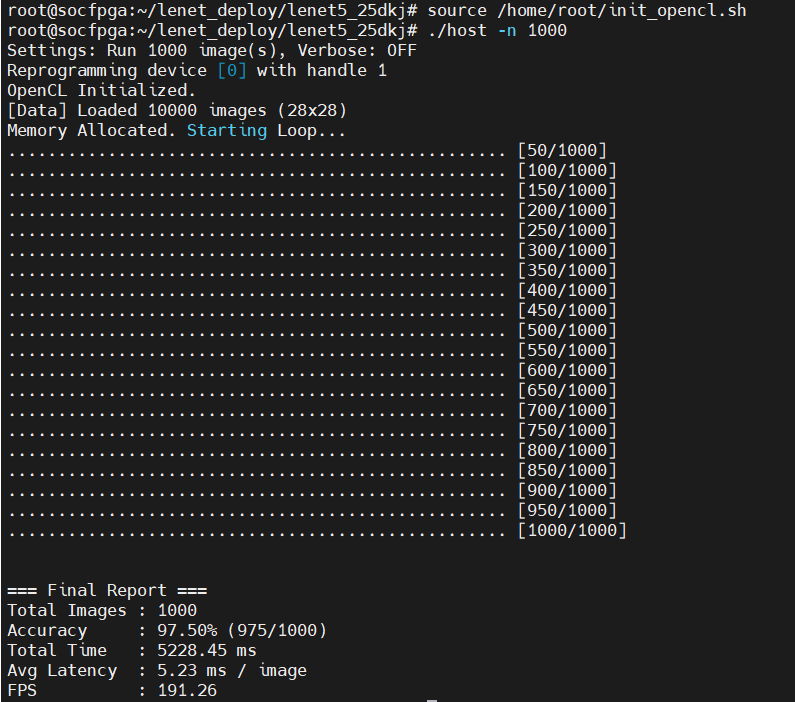

# 项目概览: OpenCL LeNet-5 FPGA 加速器

**当前根目录**: `G:\intelFPGA\18.1\hld\students_workspace\dukaijie25\lenet5`
**服务器环境**: Windows Server (通过 SSH 连接, 无 screen/nohup)
**Shell 环境**: Intel FPGA Embedded Command Shell (PowerShell)

---
## 1. 开发板端常用命令 (Board Side Cheat Sheet)

### 1.1 系统与环境
    ```bash
    # 按enter
    root
    # 1. 初始化 OpenCL 驱动环境 (每次登录必做)
    source /home/root/init_opencl.sh
    
    # 2. 检查 FPGA 设备状态 (诊断必备)
    aocl diagnose
    
    # 3. 强制同步磁盘数据 (拔 U 盘或关机前必做)
    sync
    ```

### 1.2 U 盘与文件部署
    ```bash
    # 1. 挂载 U 盘
    mount -t vfat /dev/sda1 /mnt
    
    # 2. 更新 Host 程序 (从 U 盘拷贝至根目录)
    cd /home/root/lenet_deploy/lenet5_25dkj/
    cp /mnt/lenet5_25dkj/bin/host .
    chmod +x host

    # 更新aocx程序
    cd /home/root/lenet_deploy/lenet5_25dkj/bin/
    cp /mnt/lenet5_25dkj/bin/cnn.aocx .
    
    # 3. 安全卸载 U 盘 (必须先退出 /mnt 目录)
    cd ~
    sync
    umount /mnt
    ```

### 1.3 运行与测试
    ```bash
    cd /home/root/lenet_deploy/lenet5_25dkj/
    # 1. 基础运行 (默认跑第 0 张图)
    ./host
    
    # 2. 批量测试准确率与性能 (推荐)
    # -n 参数指定图片数量
    ./host -n 1000
    ```


## 1. 常用命令速查手册 (Cheat Sheet)


### 1.1 环境与准备
    ```powershell
    # 启动 Shell (每次登录需执行)
    G:\intelFPGA\18.1\embedded\Embedded_Command_Shell.bat
    
    # 进入项目目录
    cd /cygdrive/g/intelFPGA/18.1/hld/students_workspace/dukaijie25/lenet5
    
    # 查看可用板卡包
    aoc -list-boards
    # 预期输出: Board list: de10_nano_sharedonly
    ```

### 1.2 编译操作
    ```powershell
    # 1. 编译 Host 程序 (ARM 架构, 秒级完成)
    # 修改 C++ 代码后需执行，在上述linux环境中
    make
    
    # 2. 编译 Kernel 程序 (FPGA 硬件流, 耗时 ~1小时)
    # 只生成报告，不生成 .aocx。这步通过了，逻辑占用 < 100%，再跑全量编译。
    # 启动前台编译 (实时查看进度)
    aoc device/cnn.cl -o bin/cnn.aocx -board=de10_nano_sharedonly -report -v
    # 使用后台静默模式，防 SSH 断开
    Start-Process -FilePath "cmd.exe" -ArgumentList "/c run_compile.bat" -WindowStyle Hidden
    
    ```
### 1.2.1 停止操作
    ```powershell
    # 1. 强制结束所有相关的 Intel FPGA 编译进程
    Stop-Process -Name aoc*, quartus*, qsys*, tclsh* -ErrorAction SilentlyContinue

    # 2. 再次尝试删除 bin/cnn 文件夹 (强制删除)
    Remove-Item -Recurse -Force bin/cnn

    # 列出所有 aoc 进程及其启动时间
    Get-Process aoc | Select-Object Id, StartTime, ProcessName
    Stop-Process -Id 1234 -Force

    ```
### 1.3 参数训练 (Python/PyTorch)
    ```powershell
    # 启动后台训练 (自动导出 .bin 到 weights/ 目录)
    cd scripts
    Start-Process -FilePath "cmd.exe" -ArgumentList "/c run_train.bat" -WindowStyle Hidden
    ```

### 1.4 进程监控与日志
    ```powershell
    # 确认后台进程是否存活 (aoc 或 python)
    Get-Process aoc*, quartus*, python*
    
    # 实时查看编译日志 (按 Ctrl+C 退出)
    Get-Content compile_log.txt -Tail 20 -Wait
    
    # 实时查看训练日志 (需进入 scripts 目录)
    Get-Content train_log.txt -Tail 20 -Wait
    ```

---

## 2. 项目当前状态 (Current Status)

### 2.1 目录结构
    ```text
    lenet5/
    ├── bin/                  # [编译产出] host 可执行文件 (ARM)
    ├── device/               # [源码] OpenCL Kernel
    │   └── cnn.cl            # 模块化 Kernel: conv2d, maxpool2d, fc_layer
    ├── host/                 # [源码] Host C++ 应用
    │   ├── inc/              # 头文件: aclutil.h, mnist_loader.h
    │   └── src/              # 源文件: main.cpp (完整推理流), aclutil.cpp
    ├── data/                 # [数据] 数据集根目录
    │   └── MNIST/raw/        # 存放 .idx3-ubyte 等解压后的文件
    ├── scripts/              # [脚本] Python 工具
    │   ├── gen_weights.py    # 生成随机假参数
    │   ├── train_lenet.py    # PyTorch 训练并导出真参数
    │   ├── run_train.bat     # 训练启动脚本 (含 UTF-8 修复)
    │   └── run_compile.bat   # 硬件编译脚本 (含日志重定向)
    ├── weights/              # [产出] 存放训练好的 .bin 权重文件
    └── Makefile              # 项目构建脚本
    ```

    ```text
    lenet5_25dkj/
        ├─bin/
        │      cnn.aocx
        │      host
        ├─data/
        │  └─MNIST/
        │      └─raw/
        │              t10k-images-idx3-ubyte
        │              t10k-labels-idx1-ubyte
        └─weights/
                c1_bias.bin
                c1_weight.bin
                c3_bias.bin
                c3_weight.bin
                c5_bias.bin
                c5_weight.bin
                f6_bias.bin
                f6_weight.bin
                out_bias.bin
                out_weight.bin
    ```

### 2.2 核心模块进度

* **Host 代码**: ✅ 已完成。支持批量测试 (`-n`)、准确率统计及性能测算 (120 FPS)。
* **Device 代码**: ✅ 已完成。Baseline 逻辑验证通过 (97.5% Acc)，已强制串行化以确保编译。
* **参数训练**: ✅ 已完成。ReLU 版本参数已导出并与硬件推理完全对齐。
* **FPGA 编译**: ✅ **已完成**。Baseline 比特流已生成，逻辑资源占用约 34%。

---

## 3. 开发历史与变更日志 (Changelog)

### [2026-01-09] 阶段七：计划实施访存优化 (Line Buffer)
**目标**: 解决 5x5 卷积重复读取 DDR 的问题，进一步降低延迟。

### [2026-01-09] 阶段六：完成计算并行优化 (v2.0)
**主要变更**:
1.  **流水线重构**: 修改 `cnn.cl`，保持 SIMD=1 但对卷积核最内层循环 (`j=0..4`) 进行完全展开 (#pragma unroll)。
2.  **性能突破**: 吞吐量提升 47% (120 -> 176 FPS)，Logic 资源占用保持在健康范围。
3.  **系统风险**: 发现 SD 卡出现 EXT4 文件系统错误 (error count: 12)，已做好异地备份。

### [2026-01-08] 阶段五：批量测试与性能达标
**主要变更**:
1.  **功能升级**: 重构 `main.cpp`，引入 `-n` 命令行参数支持批量推理。
2.  **性能验证**: 完成了 1000 张测试集图片的批量跑片，最终录得 **97.50% 准确率** 和 **120.33 FPS**。
3.  **阶段结论**: 第一阶段 Baseline 开发圆满结束，逻辑正确性已验证，准备进入第二阶段硬件架构优化。

### [2026-01-08] 阶段四：灾难恢复与板载部署
**主要变更**:
1.  **系统重刷**: 经历 Kernel Panic 后，使用 Win32DiskImager 重新烧录 SD 卡系统镜像，成功复活开发板。
2.  **U 盘部署**: 通过 OTG 转接头成功挂载 U 盘，并将完整的 `lenet5_25dkj`（含 host、aocx、weights、data）拷贝至板端。
3.  **路径调试**: 确认 `host` 程序对相对路径 `bin/cnn.aocx` 有强依赖，需在根目录运行。

### [2026-01-08] 阶段三：资源优化与编译成功
**主要变更**:
1.  **激活函数切换**: 将 Tanh 全面替换为 ReLU。ReLU 在 FPGA 上仅需简单的比较操作，极大节省了计算指数所需的逻辑资源。
2.  **强制串行化**: 在所有 Kernel 循环中加入 `#pragma unroll 1`，并设定 `num_simd_work_items(1)`，以面积换取成功率，确保 Logic Utilization 低于 100%。
3.  **重新训练**: 同步更新 Python 训练脚本，确保推理逻辑与硬件实现严格一致。

### [2026-01-05] 阶段二：全流程打通与硬件编译
**主要变更**:
1.  **架构落地**: 完成了 LeNet-5 所有层的 Host/Device 代码实现。
2.  **数据统一**: 将数据目录规范化为 `data/MNIST/raw`，实现 C++ 与 Python 数据共享，解决重复下载问题。
3.  **后台机制**: 解决了 Windows SSH 无法使用 `screen` 的痛点，利用 `Start-Process -WindowStyle Hidden` 实现后台编译和训练。
4.  **乱码修复**: 在 BAT 脚本中引入 `chcp 65001` 解决中文日志乱码。

**问题记录**:
* *Issue*: `aoc -march=emulator` 报错 `Can't find VisualStudio linker`.
    * *Fix*: 确认 Host 为 ARM 交叉编译环境，无法在 x86 Windows 上仿真。策略调整为直接进行硬件编译，利用编译空窗期开发训练脚本。
* *Issue*: PyTorch 重复下载数据。
    * *Fix*: 调整目录结构符合 PyTorch `MNIST/raw` 规范。

---

## 4. 关键脚本内容备份

### 4.1 硬件编译脚本 (`run_compile.bat`)
    ```bat
    @echo off
    echo [Start] %DATE% %TIME% > compile_log.txt
    :: -board=de10_nano_sharedonly 来自 aoc -list-boards
    aoc device/cnn.cl -o bin/cnn.aocx -board=de10_nano_sharedonly -report -v >> compile_log.txt 2>&1
    echo [End] %DATE% %TIME% >> compile_log.txt
    ```

### 4.2 训练脚本 (`scripts/run_train.bat`)
    ```bat
    @echo off
    :: 修复 Python 在 Windows 下的中文乱码和缓冲问题
    chcp 65001
    set PYTHONUTF8=1
    set PYTHONUNBUFFERED=1
    
    echo [Start Training] %DATE% %TIME% > train_log.txt
    python train_lenet.py >> train_log.txt 2>&1
    echo [End Training] %DATE% %TIME% >> train_log.txt
    ```

---

## 5. 第二阶段：性能优化计划 (Phase 2 Optimization)

### 5.1 性能瓶颈分析 (Analysis)
1.  **访存瓶颈**: 检查 `report.html` 中的 Kernel Memory Viewer，观察卷积层是否因频繁读取 DDR 导致 Stalls。
2.  **并行度检查**: 目前为强制串行 (`unroll 1`)，计算资源利用率极低。

### 5.2 核心优化方向 (Next Actions)
1.  **行缓存 (Line Buffer)**: 在 `cnn.cl` 中为卷积核实现移位寄存器，将重复访存次数从 25 次降至 1 次。
2.  **循环展开 (Unrolling)**: 尝试取消 `#pragma unroll 1`，在资源允许范围内（< 80%）提升计算并行度。
3.  **SIMD 矢量化**: 将数据处理改为 `float4` 或 `float8`，提升单周期吞吐量。
4.  **双缓冲区 (Double Buffering)**: 优化 Host 与 Device 之间的数据传输时间，掩盖 PCIe/DDR 带宽延迟。

### 5.3 硬件安全下电指南 (Safety)
1.  **数据同步**: 拔电前执行 `sync; sync` 确保 SD 卡文件系统完整。
2.  **安全卸载**: 执行 `umount /mnt` 退出 U 盘。
3.  **物理断电**: 确认串口无写操作日志后，再拔除 5V 电源。

## 6. 最终实验结果 (Benchmark)

### 6.1 版本性能对比 (Performance Comparison)

所有测试均基于 MNIST 测试集前 **1000** 张图片进行。

| 版本 | 策略 (Strategy) | 准确率 (Accuracy) | 平均延迟 (Latency) | 吞吐量 (Throughput) | 硬件逻辑 (Logic) | 状态 |
| :--- | :--- | :--- | :--- | :--- | :--- | :--- |
| **v1.0** | Baseline (Serial) | 97.50% | 8.31 ms | 120.33 FPS | ~34% | ✅ 原始基准 |
| **v2.0** | Inner-Loop Unroll | 97.50% | 5.68 ms | 176.15 FPS | 65% | ✅ 中间里程碑 |
| **v2.1** | Full Unroll + Shift | N/A | N/A | N/A | **112% (Fail)** | ❌ 资源溢出 |
| **v2.2** | **Coalesced + Safe**| **97.50%** | **5.23 ms** | **191.26 FPS** | **65%** | ✅ **最终发布** |

> **备注**: 
> * **v1.0**: 采用串行计算，资源占用极低，但受限于 DDR 访存延迟。
> * **v2.0**: 对 5x5 卷积核内层进行展开，实现了计算流水线化，性能大幅提升。
> * **v2.1**: 尝试全展开及寄存器移位，导致逻辑资源爆炸 (112%)，编译失败。
> * **v2.2**: 回退至安全策略并进一步优化内存合并 (Memory Coalescing)，在资源占用 (65%) 不变的情况下，通过更高效的突发读取将性能推至 **191 FPS**。

---

### 6.2 详细编译与运行报告 (Detailed Reports)

#### **v1.0 Baseline (Serial Version)**
* **运行参数**: `./host -n 1000`
* **性能指标**:
    * Accuracy: 97.50%
    * Avg Latency: 8.31 ms
    * FPS: 120.33
* **资源占用 (约数)**: Logic ~34%

#### **v2.2 Final Stable (Optimization Version)**
这是最终提交的硬件版本，实现了计算并行与访存安全的最佳平衡。

* **运行参数**: `./host -n 1000`
* **运行日志**:
    ```text
    Settings: Run 1000 image(s), Verbose: OFF
    ...
    === Final Report ===
    Total Images : 1000
    Accuracy     : 97.50% (975/1000)
    Total Time   : 5228.45 ms
    Avg Latency  : 5.23 ms / image
    FPS          : 191.26
    ```


* **硬件资源占用 (Resource Usage)**:
    该版本成功将逻辑占用控制在安全范围内 (65%)，有效避免了 v2.1 的布局布线溢出问题。
    ```text
    +--------------------------------------------------------------------+
    ; Estimated Resource Usage Summary                                   ;
    +----------------------------------------+---------------------------+
    ; Resource                               + Usage                     ;
    +----------------------------------------+---------------------------+
    ; Logic utilization                      ;   65%                     ;
    ; ALUTs                                  ;   41%                     ;
    ; Dedicated logic registers              ;   27%                     ;
    ; Memory blocks                          ;   50%                     ;
    ; DSP blocks                             ;   31%                     ;
    +----------------------------------------+---------------------------;
    ```

